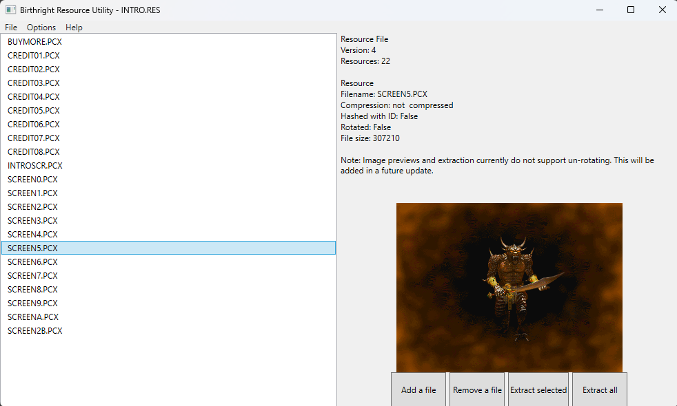

 

# Birthright Resource Utility (BRUT)

A library, command line, and graphical interface to manage resourse files (`.RES`) for Birthright: The Gorgon's Alliance. It is intended to provide format parity with release versions of the game and standard functionality that might be useful for the modding community.

This tool can be used in conjunction with the [modding reference document](https://www.kiranwelle.com/birthright/modding-reference/) to expand upon the game as-is or create total conversions.

## Installation

BRUT is available for Windows, Ubuntu, and MacOS and can be found in the [releases section](https://github.com/Shiryou/brut/releases), with the most up to date development build in the [nightly tag](https://github.com/Shiryou/brut/releases/tag/nightly). It is currently only available as an archive or binary. No installer is available.

## Contributing

Issues and pull requests are welcome. Major changes should begin in an issue first to discuss.

Please update and run tests with `dotnet test` and lint with `dotnet format`.

### Help needed

Some high priority features that are needed to get to 1.0.

* **Real-world use testing!**

* [LZSS compression][issue1] to match `RESUTIL.EXE`
* [Reversal of PCX rotation][issue2]
* Unit tests
* Media previews for PCX

## Changelog

[Changelog](./CHANGELOG.md)

## License

[MIT](LICENSE)

If you decide to fork, extend, or integrate BRUT into your own project, please drop me a line. Knowing the project is useful helps keep the motivation going.

[issue1]: https://github.com/Shiryou/brut/issues/1
[issue2]: https://github.com/Shiryou/brut/issues/2
